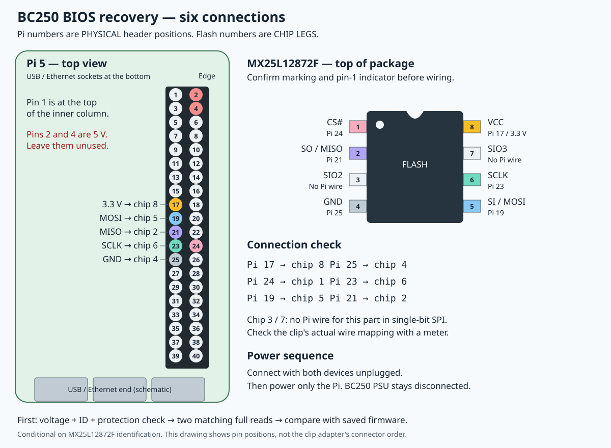

# Recovering the BC250 BIOS with the Raspberry Pi 5

**2026-09-25:** the working control BIOS has been restored through the Waveshare
USB programmer and independently read back in full with the expected checksum.
The user powered the BC250 back on, and SSH confirmed a successful fresh boot
at 15:01 UTC: 8 cores/16 threads, working CPU power saving, and no failed
services. Follow the [Waveshare guide](waveshare-j4004.md) for that setup.

**Waveshare USB programmer:** follow the [Waveshare-to-J4004 guide](waveshare-j4004.md)
for the replacement adapter. The GPIO procedure below is retained as the
historical setup; its connected-power problem remains unresolved.

The Pi is prepared at **192.168.0.27** (`raspberrypi.local`, user `pi`).
The GPIO-header SPI device is **`/dev/spidev0.0`**, verified against its RP1
device-tree path. Flashrom 1.4.0 is installed. The working control BIOS is on
the Pi and its full 16 MiB checksum has been verified.

**First connection test, 2026-09-24 20:36 UTC:** probes at 512 and 128 kHz
returned only `FF FF FF`; no chip was detected. No array read or write was
attempted. Check contact, wire mapping and chip supply before retrying.

This guide assumes the chip is
the **Macronix MX25L12872F**, likely `MX25L12872FM2I-10G`, identified from the
earlier faint marking. Confirm the marking and pin-1 indicator before applying
power. The expected package is the wide **200-mil SOP8**. A different chip or
an uncertain pin-1 position needs a new check, not a guessed connection.

You can do the wiring; I can run the detection, backups, comparison and restore
over SSH. There is no need to run the commands below while assembling the clip.



## Alternative: use the J4004 programming header

**[Simple Pi-to-J4004 connection guide and diagram](pi-j4004.md)**

**Current stop condition:** the user reports the Pi boots with J4004 leads
removed but not attached. Keep the leads disconnected pending unpowered
mapping/short checks and assessment of the target supply load. Do not attach
the leads after the Pi has booted. This shared header does not electrically
isolate the BIOS flash from the BC250 board.

J4004 exposes the BIOS flash SPI signals on a 2.54 mm header. This provides
an alternative to the clip and more accessible measurement points. Its
connection on this board still needs checking; it has not yet been probed here.
The existing SVG describes **chip legs**, not J4004 positions.

The [original community hardware reference](https://github.com/mothenjoyer69/bc250-documentation/blob/main/hardware.md#j4004)
shows this layout. View from the component side and orient the header so the
white pin-1 triangle is at the lower-left VCC position:

```text
       [ GND   SCLK   MOSI   unused ]
       [ VCC   CS#    MISO   absent ]
          ^ white pin-1 marker
```

Some archived references number across rows; others alternate between rows.
Use the signal positions and physical marker, not a bare pin number taken
from another guide. J4004 does not have the flash package's pin order.
Leave the final column unconnected.

| J4004 signal | Corresponding flash leg | Pi physical header pin |
| --- | --- | --- |
| VCC | 8 | 17 (3.3 V) |
| GND | 4 | 25 |
| CS# | 1 | 24 |
| SCLK | 6 | 23 |
| MOSI | 5 | 19 |
| MISO | 2 | 21 |

With both devices unpowered and the harness disconnected from the Pi, remove
the clip and verify continuity from J4004 to the corresponding chip legs,
especially VCC and GND. With the clip removed the legs are easier to reach.
The signal-to-leg mapping follows the Macronix datasheet linked below. If the
marker or missing-pin layout does not match, inspect the actual board before
connecting power. No pinout is established by a powered trial-and-error probe.

Both headers are male: use six **female-to-female 2.54 mm jumper leads**.
Once verified, connect those leads directly to J4004 and leave the clip off.
Keep the BC250 PSU disconnected for our Pi-powered arrangement. The supply
measurement can then be taken across J4004 VCC/GND. The same identification,
protection, two-read and restore checks below still apply. A direct header
connection removes the clip contact from the path; it does not isolate the
flash from the rest of the board or establish that in-circuit power is stable.

## 1. Identify the two ends

On the **Pi**, these are **physical positions on the 40-pin header**, not BCM
GPIO numbers. Viewed from above with the USB/Ethernet sockets toward the bottom
and the GPIO header on the right, pin 1 is at the top of the inner column.
The inner column is odd-numbered; the column by the board edge is even-numbered.
Confirm the pin-1 marking before counting. The selected pins are in the middle
of the header, physical positions 17–25.

On the **BC250**, attach the clip directly to the eight-legged Macronix flash
package identified earlier. The table's chip numbers refer to its **legs**,
not connector/header positions or the ordering of a ribbon-cable socket.

Looking down at the **top of the chip**, rotate it so its pin-1 indicator is
at the upper left:

```text
                  pin-1 end
                  ┌─────────┐
   CS#        1 ──┤ •       ├── 8    VCC (3.3 V)
   SO/MISO    2 ──┤         ├── 7    SIO3
   SIO2       3 ──┤         ├── 6    SCLK
   GND        4 ──┤         ├── 5    SI/MOSI
                  └─────────┘
```

The clip's red stripe often denotes its pin-1 wire, but establish the mapping
with its documentation or a continuity meter. Do not assume the ribbon adapter
numbers correspond to the chip-leg numbering without checking.

## 2. Wire these six connections with both devices unpowered

| Pi physical pin | Pi function | BC250 flash-chip leg | Flash signal |
| --- | --- | --- | --- |
| **17** | 3.3 V supply | **8** | VCC |
| **25** | Ground | **4** | GND |
| **24** | GPIO8 / SPI0 CE0 | **1** | CS# / chip select |
| **23** | GPIO11 / SPI0 clock | **6** | SCLK |
| **19** | GPIO10 / SPI0 MOSI | **5** | SI/SIO0, data into the flash |
| **21** | GPIO9 / SPI0 MISO | **2** | SO/SIO1, data out of the flash |

For the **MX25L12872F specifically**, leave the clip leads for **chip legs 3
and 7 unconnected to the Pi**. They are SIO2/SIO3 for quad transfers; our
standard single-bit SPI transaction uses SI/SO. This is a connection choice
derived from the manufacturer's pin functions and single-I/O protocol, not an
instruction to cut their existing connections on the BC250. Do not strap them
directly to 3.3 V using a generic WP#/HOLD# pinout. The fixed QE bit does not
prevent single-I/O commands. [Macronix datasheet, pp. 5–6 and 30](https://www.macronix.com/Lists/Datasheet/Attachments/8935/MX25L12872F,%203V,%20128Mb,%20v1.1.pdf)

1. Shut down the Pi with `sudo poweroff`, then **unplug its USB-C power**.
   A halted Pi can still supply power at the header.
2. **Disconnect the BC250 PSU from the board**. Disconnect other externally
   powered connections that might supply power, such as a powered USB hub.
   Leave the BC250 unpowered throughout programming.
3. Use short leads, preferably around 10–15 cm where practical. Check the
   loose clip/adapter wire mapping with a continuity meter before attaching it.
4. Connect the six leads and seat the clip squarely: one contact on each leg,
   no exposed connector touching a neighbouring pin. Insulate unused leads.
5. Recheck pin 1, the six endpoints, and that Pi physical **2/4 (5 V)** are
   unused. The flash's normal operating supply is **2.7–3.6 V**, nominally 3.3 V.

The Pi header mapping follows the
[Raspberry Pi GPIO reference](https://www.raspberrypi.com/documentation/computers/raspberry-pi.html#gpio-and-the-40-pin-header)
and [flashrom's Raspberry Pi programmer guide](https://github.com/flashrom/flashrom/blob/main/doc/user_docs/raspberry_pi.rst).

## 3. Check power and contact before software tests

With power disconnected, check each intended path from its Pi connector to
the corresponding clip contact/chip leg. Check the harness for accidental
shorts between adjacent contacts. In-circuit resistance between supply and
ground is affected by the board; a continuity beep alone does not diagnose a
short.

Then power **only the Pi** using its normal USB-C supply. Keep the BC250 PSU
disconnected. If you have a multimeter, measure DC voltage between flash
**leg 8 (+)** and **leg 4 (ground)**, preferably via accessible clip breakout
points to avoid bridging adjacent chip legs with a probe. Expect roughly
**3.3 V**, including during reads. A markedly drooping supply, voltage above
3.6 V, Pi resets or unexpected heating means stop and disconnect Pi power.

The flash VCC connection can partially power other BC250 circuitry. If that
prevents stable access, we may need chip isolation or out-of-circuit programming.
Do not try to fix it by adding BC250 PSU power alongside the Pi's 3.3 V supply.
[Flashrom documents this in-circuit limitation](https://github.com/flashrom/flashrom/blob/main/doc/user_docs/in_system.rst).

No multimeter reading or chip detection alone proves that the connection is
reliable. The following data checks are required before writing.

## 4. Detect the chip and inspect protection

I will run this over SSH after the physical checks. Start a fresh run directory
so earlier reads/logs are never overwritten:

```bash
umask 077
RUN=$(mktemp -d "$HOME/bc250-recovery-20260924/connection-XXXXXXXX")
cd "$RUN"
PROGRAMMER='linux_spi:dev=/dev/spidev0.0,spispeed=512'
CHIP='MX25L12835F/MX25L12873F'

sudo flashrom -p "$PROGRAMMER" -c "$CHIP" -V -o probe.log
sudo flashrom -p "$PROGRAMMER" -c "$CHIP" --wp-status -V -o protection.log
```

These are probe/status commands, not an erase or array write. `spispeed` is
in **kHz**. Expect JEDEC ID **C2 20 18** and **16,384 KiB / 16,777,216 bytes**.
The installed flashrom profile uses related Macronix part names; that shared
ID does not establish the exact 72F suffix. Physical identification matters.

**Review both logs before reading the array.** The earlier internal checks
showed status **0x40**, protected range **none**, protection mode **disabled**,
and advanced sector protection off. Confirm those conditions externally;
an unsupported protection query or changed state means stop and investigate.
We will not force a probe or change protection/OTP/QE to get past a failure.

This gate matters because flashrom 1.4 can call a chip's unlock routine even
for reads. In the reviewed profile, already-clear protection bits make that
routine return without writing the status register. We must establish that
state first, rather than assuming every `-r` invocation has no register side
effects. [Flashrom access path](https://github.com/flashrom/flashrom/blob/v1.4.0/flashrom.c),
[status-register implementation](https://github.com/flashrom/flashrom/blob/v1.4.0/spi25_statusreg.c).

## 5. Read twice and compare the actual bytes

After the protection review, in the same shell/run directory:

```bash
sudo flashrom -p "$PROGRAMMER" -c "$CHIP" -r before-1.rom -o read-1.log &&
sudo flashrom -p "$PROGRAMMER" -c "$CHIP" -r before-2.rom -o read-2.log &&
sudo cmp before-1.rom before-2.rom &&
sudo stat -c '%n %s bytes' before-1.rom before-2.rom &&
sudo sha256sum before-1.rom before-2.rom
```

A 16 MiB transfer at 512 kHz has a theoretical minimum of about **4.4 minutes**;
allow longer for flashrom overhead. A quiet read is not automatically a hang.
Keep the clip and power steady throughout both reads.

Acceptance requires all of the following:

- Both commands succeed; each dump is exactly **16,777,216 bytes**.
- `cmp` succeeds and both SHA256 hashes are identical.
- The dumps contain the expected firmware, rather than all-00/all-FF or a
  repeating faulty pattern. I will copy the dumps and logs to the workstation
  and compare against the complete saved image and its firmware regions.

The last image written, before the failed boot, had SHA256:

`1b43de5733bfeebd79639f855eaff4eba2f19141969a45eb2fc7e91e987b3d2f`

An exact match is strong evidence of correct full-chip reads. Boot attempts
could have changed settings bytes, so a different hash needs a byte-level
comparison; it is not automatically a bad clip or automatically acceptable.
Identical garbage twice does **not** pass. Successful reads also do not prove
that erase/program operations will work.

If either read differs, stop before writing. Power down/unplug the Pi before
reseating anything. Check contact, pin mapping, lead length and supply; if
needed we can retry at **128 kHz**. Do not respond by using `--force`.

## 6. Restore and independently verify

After the preceding checks and off-board backup, I will use the saved
**known-working control BIOS**, preserving this board's firmware/settings.
It passed both a software reboot and the user's physical power-cycle test.

Pi path:

```text
/var/lib/bc250-recovery/setup-Rl1O1Tzo/bc250-control-recovery-20260924/RECOVERY-control-coldboot-20260924.rom
```

Required SHA256:

`f1251268fc129d6799fcb75041017ee739250d71b7c9d1981d67016923834183`

I will recheck that hash immediately before the write, use normal flashrom
write-with-verification, and then take a separate full readback. That readback
must compare byte-for-byte with the control ROM and have the same hash. There
is no separate blanket erase step, no disabled verification and no retry of
the failed video-key image. The write command will be selected after reviewing
the actual external probe, protection state and dump comparison.

If programming or verification fails, keep the setup steady and retain the
logs for diagnosis; do not reconnect BC250 power or remove the clip mid-operation.

## 7. Disconnect, boot and validate the recovery

After successful final readback: shut down the Pi, unplug its USB-C supply,
remove the clip and all programming leads, then reconnect BC250 power.
Check for display/POST and SSH at the BC250's previous address **192.168.0.49**.
I will check firmware/OS startup, CPU/CU configuration and power-management
settings. A verified write alone does not prove a successful boot.

Once the control BIOS boots again, we can resume the hardware-decoding
investigation. This recovery procedure itself does not enable video decoding.
