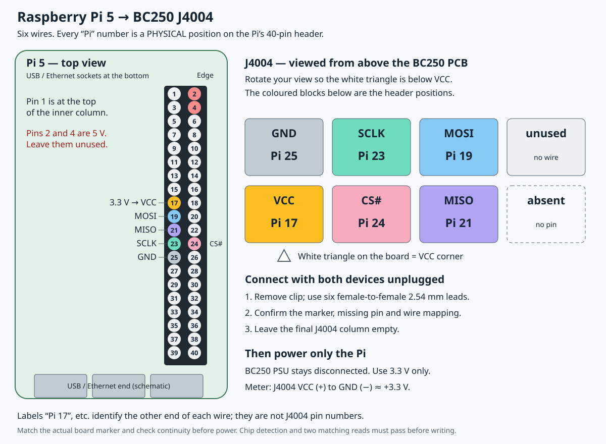

# Raspberry Pi 5 → BC250 J4004

For the replacement USB programmer, use the [Waveshare-to-J4004 guide](waveshare-j4004.md).
It uses the Pi's USB port and no Pi GPIO leads.

**Current troubleshooting:** the Pi reportedly boots only with the J4004
leads disconnected. Keep them disconnected until the wiring and target load
are checked. Do not work around this by attaching GPIO leads to a running Pi.
The diagram defines signal mapping; it does not prove the Pi can power the
BC250's connected 3.3 V circuitry. No J4004 identification/read has succeeded.

**Unplug both devices before wiring. Remove the BIOS clip. Keep the BC250
PSU disconnected; after checking the connections, power only the Pi.**



All **Pi numbers are physical positions on its 40-pin header**. On the Pi,
viewed from above with the USB/Ethernet sockets at the bottom and the GPIO
header on the right, pin 1 is at the top of the inner column. Count down the
inner column 1, 3, 5…; the outer column is 2, 4, 6….

Look down onto **J4004 from the component side**. Rotate your view so its
white triangle is below the lower-left VCC position:

```text
                    J4004
       ┌────────┬────────┬────────┬────────┐
       │  GND   │  SCLK  │  MOSI  │ unused │
       │ Pi 25  │ Pi 23  │ Pi 19  │        │
       ├────────┼────────┼────────┼────────┤
       │  VCC   │  CS#   │  MISO  │ absent │
       │ Pi 17  │ Pi 24  │ Pi 21  │        │
       └────────┴────────┴────────┴────────┘
           ▲ white triangle on the BC250 PCB
```

| Pi physical pin | Connect to J4004 signal |
| --- | --- |
| **17** — 3.3 V | **VCC** |
| **25** — ground | **GND** |
| **24** — chip select | **CS#** |
| **23** — clock | **SCLK** |
| **19** — data out | **MOSI** |
| **21** — data in | **MISO** |

Both headers are male. Use **six female-to-female 2.54 mm jumper leads**.
Male-to-female leads cannot directly connect these two headers.
**Leave the final J4004 column empty.**
Pi physical pins **2 and 4 are 5 V: leave them unused**. The labels `Pi 17`,
etc. in the J4004 drawing identify the other end of each wire, not J4004 pin
numbers. Sources use different numbering conventions for J4004.

If you have a solderless breadboard, twelve male-to-female leads can substitute:
for each signal, put the two female ends on the corresponding Pi/J4004 pins
and the two male ends into the same connected five-hole strip. Use a separate,
electrically isolated strip for each of the six signals. Confirm each pair's
continuity while unpowered; keep the leads short. A pair of male-to-female
leads alone cannot connect the two male headers.

Before powering, confirm the triangle and missing-pin position match the
drawing. With the clip removed and everything unpowered, verify J4004 VCC
connects to flash leg 8 and GND to leg 4. The other connections are CS#→1,
SCLK→6, MOSI→5, MISO→2. Do not power an uncertain orientation.

After connecting and powering only the Pi, DC voltage across **J4004 VCC (+)**
and **GND (−)** should be about **+3.3 V**. Keep the leads stationary for
identification and two complete matching reads. No flashing until those checks
pass. [Full recovery procedure](bios-recovery.md)

Sources: [BC250 J4004 layout](https://github.com/mothenjoyer69/bc250-documentation/blob/main/hardware.md#j4004),
[Pi SPI wiring](https://github.com/flashrom/flashrom/blob/main/doc/user_docs/raspberry_pi.rst),
[Macronix flash pinout](https://www.macronix.com/Lists/Datasheet/Attachments/8935/MX25L12872F,%203V,%20128Mb,%20v1.1.pdf).

This guide describes the intended wiring; this board's J4004 connection has
not yet passed a chip-identification or read test.
