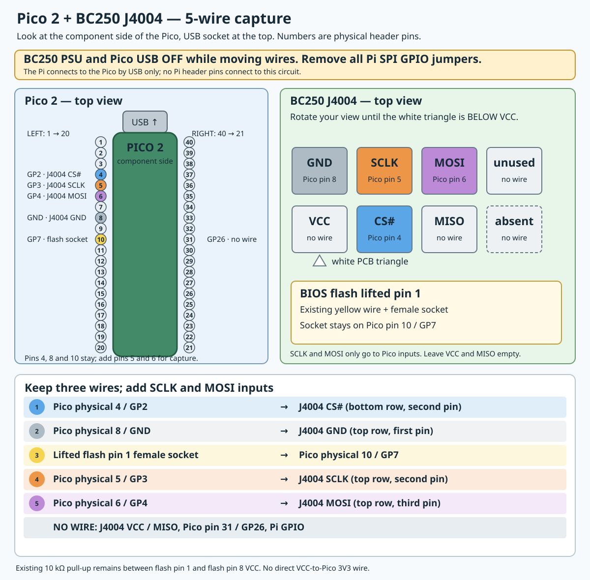

# CS# pass-through with read-command context capture

The first physical trial booted Fedora through the Pico's CS# relay with the
original BIOS flash supplying every byte. This follow-up adds two input-only
signals so the Pico can record READ03 addresses around the key, TOS and driver
regions while leaving the successful relay unchanged. It does not write the
BIOS, drive SCLK or MOSI, or substitute firmware bytes.

The three existing connections remain in place. **Power off the BC250 and
remove its AC/PSU power, then unplug Pico USB before adding these two straight
jumpers. A Linux shutdown alone may leave standby power present. Keep the Pi SPI
GPIO wires removed; the Pi connects to the Pico by USB only.

| J4004 contact | Pico 2 contact | Purpose |
|---|---|---|
| CS#, bottom row second | GP2, physical pin 4 | Motherboard CS# input; existing |
| GND, top row first | GND, physical pin 8 | Common ground; existing |
| Lifted flash pin 1 socket | GP7, physical pin 10 | Flash CS# sink; existing |
| SCLK, top row second | GP3, physical pin 5 | Input-only clock observation; new |
| MOSI, top row third | GP4, physical pin 6 | Input-only command observation; new |

For J4004, orient the board until its white triangle is below VCC. With the
Pico component side up and USB at the top, physical pins 4, 5, 6, 8 and 10
are all on the **left** header, numbered downward. Leave J4004 VCC, MISO,
Pico GP5, GP26 and all Pi GPIO pins unconnected. The existing 10 kΩ resistor
between the lifted flash leg and flash pin 8 stays in place. No added resistor
or splice is used in this capture stage.

The image `output/pico2/candidates/cs-pass-hunt-v01/bc250_cs_pass_hunt.uf2`
is RAM-only. It must be loaded and `arm-pass` acknowledged while the BC250 is
off, because the Pico's persistent image is the passive input-only build.
The same candidate is staged on the Pi at
`/home/pi/bc250-pico2-20260926/candidates/cs-pass-hunt-v01/` with SHA-256
`091410b7912c83b908f0f991197ef00b9539bc046ff6f38495a58ad0f0a74252`.
The host starts `hunt-pass` before the BC250 is powered. The hunter records
matching READ03 commands and their two immediately preceding command words.
It reports any FIFO stall or hit-buffer overflow; a capture with either flag
is unsuitable for ordering a firmware patch. GP7 remains the same open-drain
CS# relay throughout the hunt. The Pico USB must remain powered while the
BC250 is on.

To return to stock without the Pico, power off both devices and move the
lifted-leg female socket from GP7 back to J4004 CS#.

## Physical result, 2026-09-27

After the two new jumpers were connected, the BC250 initially failed to boot
because reconnecting Pico USB restored its persistent passive image. We loaded
this candidate into Pico SRAM, confirmed `armed=0 gate=0 host_cs=1 pio_oe=0`,
armed CS-PASS, started the hunt, and power-cycled PDU outlet 8. Fedora booted
and `systemctl is-system-running` reported `running`. Pico status afterward
showed `armed=1 gate=1 host_cs=1 pio_oe=0` at idle. No BIOS or Pico flash was
written.

The 90-second capture reports 1,832,062 observed commands, 3,727 filtered
hits, zero hit-buffer overflow and zero RX FIFO stall. The filtered stream
contains two identical 1,856-hit sequences at a constant offset of 914,177
transactions. Each sequence covers all 318 four-byte words changed by the
retained overlay: 64 in type-50, 190 in TOS and 64 in the driver. Each has two
complete reads through the type-50 modulus region. Fifteen later filtered
hits are outside those repeated sequences. The first sequence may reflect a
retry already in progress before the PDU cycle; the capture has no power
timestamp to prove where each boot began.

The analysis is reproducible with
`tools/pico2-interposer/analyze_cs_pass_hunt.py` and retained locally as
`output/pico2/boot-hits-20260927-analysis.json`. This sniffer saved only five
address ranges and each hit's two preceding commands. The constant offset
does not prove the unrecorded SPI commands matched, so it is not yet a full
board PATCH profile or an active firmware-injection test.

The later [lossless full-command capture](pico2-full-boot-trace.md) used these
same five wires and confirmed the complete command order through every
changed firmware word.
