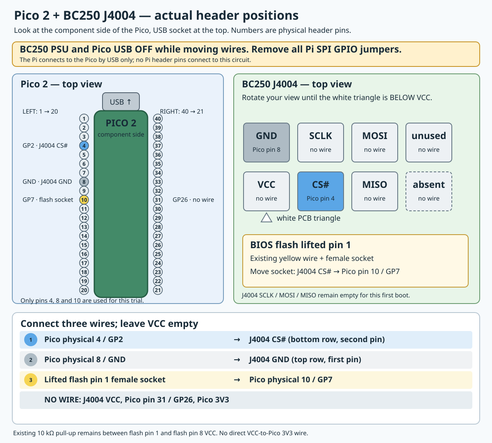

# Original-flash CS# pass-through trial

2026-09-27. This trial tests whether the Pico can relay the motherboard's CS#
to the **original BIOS flash** while that flash supplies all data. It does not
substitute firmware, write the BIOS, or unlock VCN. The RAM-only image is
`output/pico2/candidates/cs-pass-v02/bc250_cs_pass.uf2`; the same file is staged
on the Pi at `/home/pi/bc250-pico2-20260926/candidates/cs-pass-v02/`.
Its SHA-256 is `70b5af760d37bd4a30b4c0efc35d758cbfb5c415563a63b3f093844660e3829d`.



The existing 10 kΩ resistor from the lifted flash pin 1 CS# leg to flash pin
8 VCC stays in place. The resistor is powered by the BC250, not the Pico.
The movable female connector on pin 1 currently goes to J4004 CS# for STOCK.
The pass-through trial moves it to Pico GP7 / physical pin 10 **only while
the BC250 and Pico are unpowered**.

Before making board connections, remove **all five Pi SPI0-to-Pico header
leads**. The Pi-to-Pico USB cable is the only Pi connection; do not connect
Pi SPI0 and BC250 J4004 to the same Pico pins. The Waveshare remains
disconnected.

| Connection | Pico 2 physical pin | Purpose |
|---|---:|---|
| J4004 CS# → GP2 | 4 | Motherboard CS# input |
| J4004 GND → GND | 8 | Common reference |
| Lifted flash pin 1 female socket → GP7 | 10 | Original flash CS# sink |

No new resistors or splices are needed. The existing 10 kΩ pull-up from flash
pin 1 to pin 8 stays as installed. **J4004 VCC and Pico GP26/pin 31 stay
unconnected; do not connect J4004 VCC to Pico 3V3, VSYS or VBUS.** Pico GP3,
GP4, GP5 and GP6 are also unused for this pass-through.

Pico viewed component side up with USB at the top: pins 4, 8 and 10 are on
the **left** edge, counting downward from top-left pin 1. Pin 31 is on the
**right** edge, counting upward from bottom-right pin 21. For J4004, turn the
board until its white triangle is below VCC:

```text
            J4004
 [ GND    SCLK    MOSI    unused ]
 [ VCC    CS#     MISO    absent ]
    ▲ white triangle
```

With power removed, use the meter to confirm the lifted flash leg is no
longer connected directly to J4004 CS# once its socket is moved to GP7.
Confirm about 10 kΩ from the lifted leg to flash pin 8. Check for accidental
shorts and keep the lifted-leg wire strain-relieved.

After wiring, connect Pico USB to the Pi while the BC250 remains off. The
persistent passive image may start if USB was unplugged; the prepared RAM image
must be loaded again before the board is powered. `status` must report the
200 MHz CS-PASS v2 image, `armed=0` and `gate=0`. Then `arm-pass` restarts
the PIO at a released-CS# state and enables pass-through. `cancel` forces
GP7 high impedance. The output latch is forced low at all times, so the Pico
never drives the flash's CS# high; the installed resistor returns it to the
flash's own supply. Arm while the BC250 is off, then power the board.

The PIO digital replay of four clean BC250 captures gave at least 20 ns of
CS# setup at a modeled 200 MHz over the shortest captured windows. This is an
upper bound on real electrical margin because pad, wire and pull-up rise
times were not measured. The v2 image was verified in Pico SRAM, accepted its
arm/cancel commands, and remained at `pio_oe=0` after 1,024 isolated Pi SPI
transactions requested at 33 MHz; GP7 was unconnected for that test.

**Physical result, 2026-09-27:** The user connected the three wires and
powered the BC250 after reconnecting Pico USB. It did not boot because the
Pico had returned to its persistent passive image (`outputs=OFF`). We loaded
v2 into Pico SRAM, observed `host_cs=1` and `pio_oe=0`, armed `arm-pass`, and
power-cycled outlet 8. The BC250 then booted Fedora and answered SSH at
`192.168.0.49`; `systemctl is-system-running` reported `running`. The Pico
remained armed with its idle PIO OE released. This is a successful original-
flash CS# pass-through boot without any BIOS or Pico flash write. If a later
trial fails, restore STOCK by turning both devices off and moving the female
socket back to J4004 CS#.

The Pico's 200 MHz clock/1.20 V setting is an experimental overclock above
the RP2350's rated 150 MHz. See the [measured timing report](pico2-measured-timing.md).
