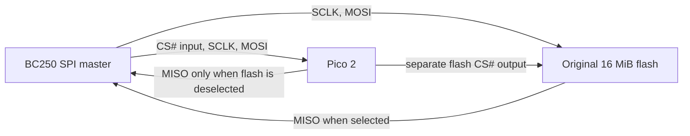

# Pico 2 with the original BIOS flash

**Status: feasible in principle, not wired or timing-validated.** This is an
alternative to the [published BC250 two-flash interposer](https://habr.com/ru/companies/pt/articles/979470/).
The original, working 16 MiB flash would answer ordinary reads. A Pico 2 would
answer only a known first-pass key-database read from a small image in SRAM;
the later integrity-check read would come from the original flash. No on-board
flash write is part of this route.

2026-09-26 update: there are two firmware images in the
[implementation](../tools/pico2-interposer/README.md): passive capture and the
interceptor, which also runs the isolated Pi bench. The interceptor's current
profile is synthetic. Follow the [wiring guide](pico2-wiring.md) and
[validation status](pico2-router-validation.md).

The retained signer and signed TOS/driver route preserve the existing type-51
keys and add the authentic VCN key in modeled PSP RAM. The retained working
ROM and patched comparison differ in 1,229 bytes across 318 aligned words.
Type-50 key words come from the patch during the RAM-copy pass and from the
original chip during verification; TOS/driver changes are supplied on their
reads. Identifying these passes on the actual board remains essential.
The standalone patched ROM must never be written to the onboard EEPROM.

The [Pico 2 has 520 KiB SRAM and PIO](https://www.raspberrypi.com/documentation/microcontrollers/pico-series.html).
The isolated replay uses 2,468 bytes of SRAM for compressed command runs and
replacement words. The full-object capacity test needs 2,636 bytes, though its
order is synthetic. The 198,240-byte public overlay and private signing key
are retained on the workstation; only signed/public material is staged on the
Pi or embedded in the Pico. SRAM capacity passes locally; physical timing has
not yet been established.

## Required isolation

The motherboard's CS# trace must be **electrically separated from the original
flash CS# pin**. The Pico reads motherboard CS# and drives a separate CS# to
the flash. For ordinary reads, it selects the flash and leaves its own MISO
high-impedance. For the chosen patch transactions, it keeps the flash deselected
and drives MISO from SRAM. The original chip's CS# needs a hardware pull-up to
its own 3.3 V rail to deselect it while the Pico output is high-impedance or
disconnected. An unpowered, still-connected GPIO is not assumed high-impedance.
Pico MISO
must also default to high-impedance. Power sequencing and common ground need
validation to prevent back-powering through signal pins. A recovery jumper or
reversible fixture should restore the original CS# path if the Pico fails.

The existing J4004 header is only a parallel connection to the same SPI bus.
Plugging a Pico into J4004 does **not** isolate the original chip, so both
devices would drive MISO during a patched read. The candidate requires lifting
the original flash CS# leg, isolating its trace, or moving that **same** flash
to a one-chip interposer/socket. None of these require buying another flash IC,
but they do require physical rework or a fixture. A software-only or
clip-only connection cannot provide the needed separation. The [datasheet for
the likely MX25L12872F](https://www.macronix.com/Lists/Datasheet/Attachments/8935/MX25L12872F,%203V,%20128Mb,%20v1.1.pdf)
specifies a maximum 8 ns from CS# high to its output becoming high-impedance;
the Pico must not enable its MISO drive before that interval has passed.

The patch requires changes in both bit directions. A GPIO that only pulls
MISO low cannot supply it while the original flash continues driving. The
original flash must be deselected before the Pico enables its MISO output.

## Timing and selection

The [published demonstration](https://habr.com/ru/companies/pt/articles/979470/)
observed single-I/O `0x03` reads, four data bytes per transaction, and switched
between two flash chips **while CS# was high**. A Pico serving bytes itself is
more demanding than switching chips. For a standard `0x03` read, the address is
known only after the 8-bit command and 24-bit address; the first data bit
follows immediately. [The flash protocol](https://www.macronix.com/Lists/Datasheet/Attachments/8935/MX25L12872F,%203V,%20128Mb,%20v1.1.pdf)
has no dummy clocks. Deciding then to deselect the flash and drive MISO is
the critical timing constraint for a Pico supplying the replacement bits.

At a sufficiently slow clock, the implemented candidate can compare the full
address and switch the flash off before driving the first data bit. Its local
digital model passes through 5 MHz at 150 MHz Pico clock. The first real
captures measure about 33.27 MHz SPI, and an offline 480 MHz replay still
fails the current response path; see [measured timing](pico2-measured-timing.md).
For faster traffic, an alternative is to predict the
target before CS# falls and switch at a CS#-high boundary. A captured, repeatable
sequence could provide that earlier trigger, with the replacement word ready
before the transaction starts. For the key verification pass, the original
chip must be selected. If the
prediction is wrong and an unexpected transaction arrives while the original
chip is deselected, the Pico cannot simply hand that already-started command
back to the flash; that case must be handled as a failed trial.

## Validation gates before connecting an active Pico to the BC250

1. Complete a passive boot capture on **this board**: opcode, data length,
   ordering of the type-50 copy/check and TOS/driver reads, trigger transaction,
   CS#-high gap, and actual SPI clock. The input-only Pico image records all
   four SPI signals; the host decoder and repeated-capture check are prepared. The article's `0x039db8dc` trigger
   and `0x338` window belong to a different ROM layout and must not be reused.
2. Build and measure the one-chip fixture, including CS# isolation, a defined
   deselected reset state, matched 3.3 V logic, and no simultaneous MISO drive.
   The CH347 remains a recovery/readback tool, never a second master on a
   powered boot bus.
3. Bench-test Pico firmware with an SPI master over the measured clock range:
   verify ordinary reads against the backup, replacement key/TOS/driver words
   against the signed pair, and key verification reads against clean bytes.
   Include reset, Pico-not-ready and unexpected-command cases. Only after a
   captured trace and electrical timing pass should a BC250 boot be attempted.

This route avoids extra flash chips and EEPROM wear, but has not yet shown a
successful BC250 boot, accepted VCN key, working VCN engine or decoded frame.
The prepared TOS route preserves the existing key records in the native model;
its execution and VCN decoding on the board remain unverified.
