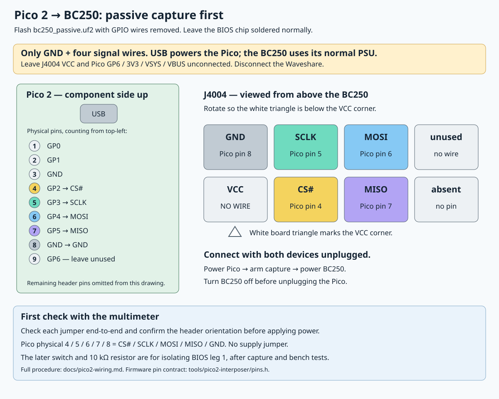
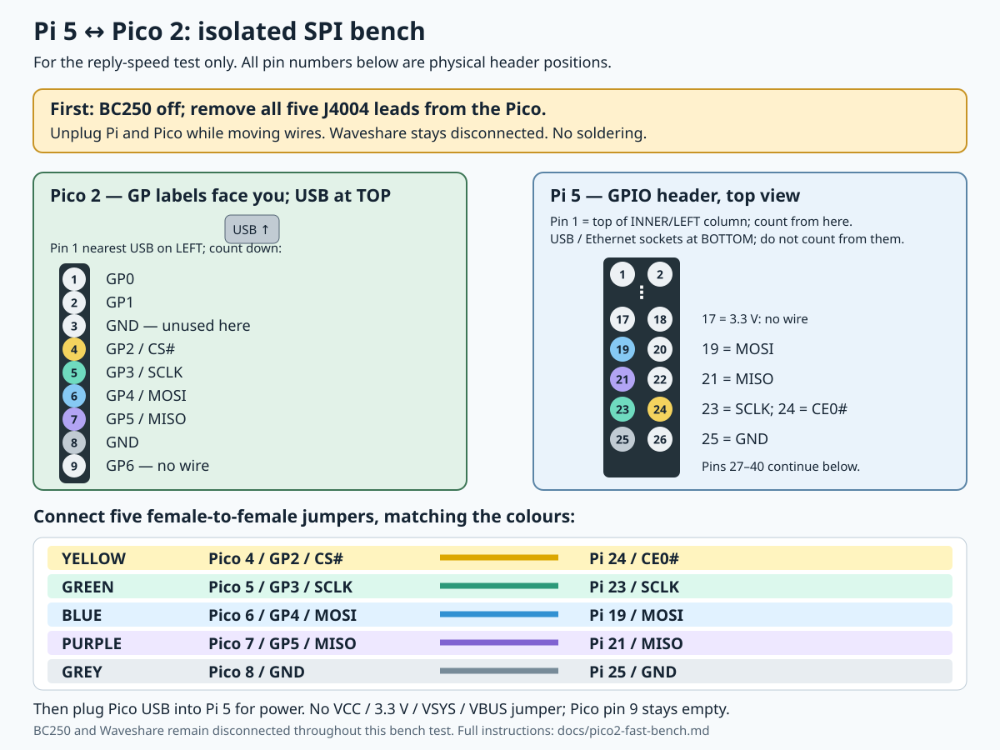
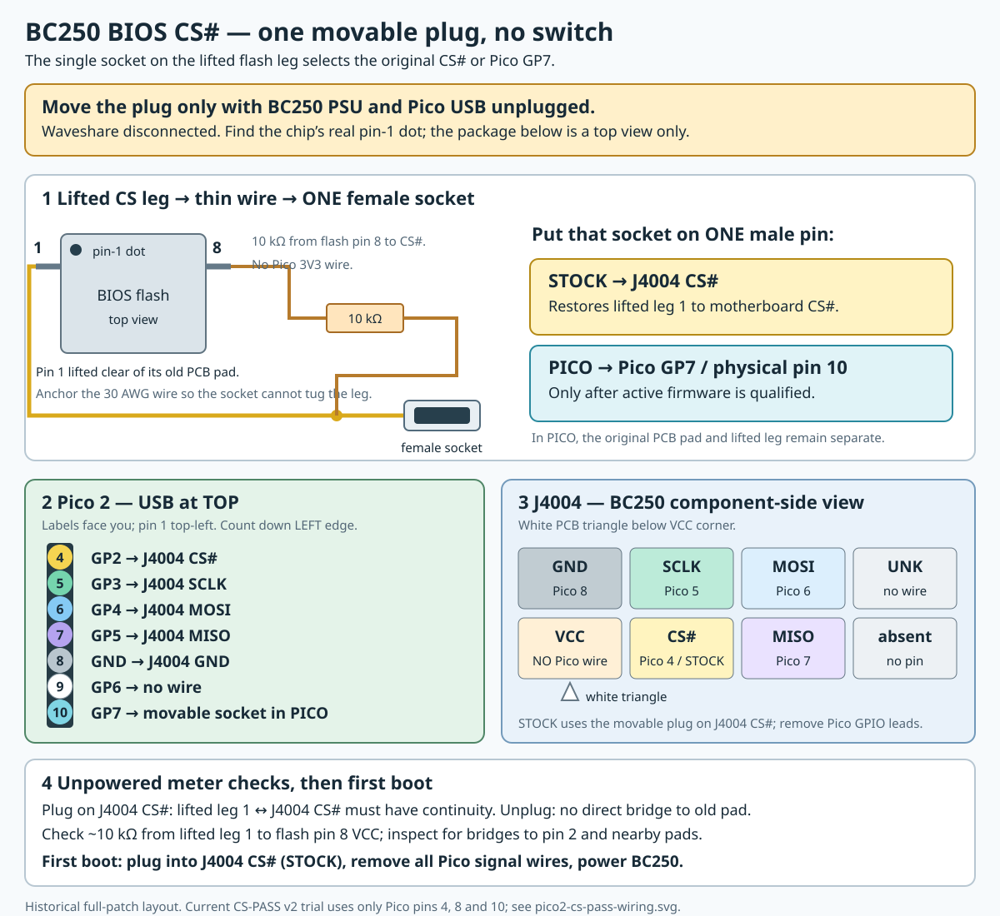

# Pico 2: passive connection and lifted CS# return path

2026-09-27. The passive five-wire captures and isolated Pi bench tests below
were completed before the BIOS chip's CS# leg was lifted. The lifted leg now
has a 10 kΩ pull-up to flash pin 8 and a lead ending in a
female socket on J4004 CS#. The BC250 **boots in STOCK mode** through this
return path. A RAM-only original-flash CS# pass-through trial is now prepared;
use its [current wiring and checks](pico2-cs-pass.md) before moving the plug.

The Pico connects by USB to the **Pi 5**. Use the [Pi quick-start](pico2-pi-start.md)
for SSH flashing, capture and decoding commands.

Firmware and host commands: [Pico implementation](../tools/pico2-interposer/README.md).
The ready files are under `output/pico2/ready/` and on the Pi at
`/home/pi/bc250-pico2-20260926`. There are **two UF2 files**:

- `bc250_passive.uf2` records addresses, data and clock timing without driving
  the bus. Use this for any repeat BC250 capture.
- `bc250_interceptor.uf2` performs address-checked routing and patch replies.
  Its current profile is a synthetic signed-payload test, so use it only on
  the isolated Pi bench with GP6 disconnected. Its response timing must be
  revised and tested before building a profile for the measured board.

The passive captures cover all 318 changed overlay words at about 33.27 MHz
SPI, with matching ROM bytes. The original 150 MHz router fails that measured
timing. Later isolated 200 MHz reply and 340 MHz guarded-selector candidates
passed Pi functional tests at a requested 33 MHz, but neither is an active
BC250 image. See the [measurement report](pico2-measured-timing.md) and
[fast bench guide](pico2-fast-bench.md).

The Pico's persistent flash image is **input-only passive with USB reset**.
The Pi can enter BOOTSEL remotely for RAM-only experiments. A guarded GP7
selector passed isolated Pi tests at a requested 33 MHz, but it has no
BC250 board profile or board-arm command. The Pico currently runs the RAM-only
CS# pass-through diagnostic, cancelled with its output disabled; unplugging
USB restores the persistent passive image on its next boot.

The following passive setup is retained for repeat measurements. The signing
key and signed payload are already prepared; no BIOS write is needed for these
tests. J4004 CS# is now occupied by the STOCK return plug: do not unplug it
to make room for a passive Pico lead. A repeat passive CS# measurement needs
a verified Y-tap on the same board-CS# net, with the STOCK return intact.

## 1. Flash the passive Pico with no GPIO wires attached

Plug USB into the Pi 5 or workstation while holding the Pico's **BOOTSEL**
button. Release after the `RP2350` USB drive appears, then copy
`bc250_passive.uf2` onto it. The Pico restarts as a USB serial device.
This writes the Pico's own flash, not the BC250 BIOS. Disconnect USB before
attaching the jumpers. Keep the Waveshare and earlier Pi GPIO programmer
wiring completely disconnected from the BC250.

## 2. Passive BC250 wiring — recorded setup before CS# rework



Pico viewed **component side up, USB socket at the top**: physical pin 1 is
top-left, left pins count down 1–20; right pins count up 21–40 from the bottom.
These are **Pico physical pin numbers**, not Pi 5 header numbers.

| BC250 J4004 signal | Pico GPIO | Pico physical pin |
|---|---:|---:|
| CS# | GP2 | **4** |
| SCLK | GP3 | **5** |
| MOSI | GP4 | **6** |
| MISO | GP5 | **7** |
| GND | GND | **8** |
| VCC | No connection | — |

Look down onto J4004 from the component side and rotate the view until the
white triangle is below its VCC corner:

```text
            J4004
 [ GND    SCLK    MOSI    unused ]
 [ VCC    CS#     MISO    absent ]
    ▲ white triangle
```

Keep Pico pins 9 (GP6), 36 (3V3), 39 (VSYS) and 40 (VBUS/5V) disconnected from
the BC250 for this stage. USB powers the Pico; the BC250's normal PSU powers
the board. **Do not join their 3.3 V supplies.** Join only ground and the four
signals listed above. Passive Pico sensing needs no additional components;
the installed 10 kΩ flash pull-up remains in place.
Keep GP7 / pin 10 disconnected too; it is the candidate for a later flash-CS#
output after the isolated GP7 bench passed.

With both devices unplugged, check every jumper end-to-end and check there are
no accidental shorts between adjacent header positions. Connect the five
leads. Power the Pico by USB first, arm capture using the host script, then
power the BC250 normally. Keep the Pico powered while attached to the running
board. When finished, turn the BC250 off before unplugging the Pico. Reflash
the Pico only with all five target leads removed.

The supplied 10 cm jumpers are reasonable for the first passive attempt; their
electrical effect still has to be checked. Put the Pico beside J4004, keep the
ground lead close to the clock lead, and avoid extensions. Unexpected boot
failure or corrupt captured bytes means stop and check signal loading/wiring.

## 3. Isolated Pi 5 bench wiring

This exercises **`bc250_interceptor.uf2`** against a controlled SPI master. Disconnect
**every BC250 and Waveshare lead** first. With Pi and Pico power removed,
make the five jumper connections below. The Pi's USB powers the Pico after
wiring:



| Pi 5 physical pin | Signal | Pico physical pin |
|---:|---|---:|
| 24 | SPI0 CE0# | 4 / GP2 |
| 23 | SPI0 SCLK | 5 / GP3 |
| 19 | SPI0 MOSI | 6 / GP4 |
| 21 | SPI0 MISO | 7 / GP5 |
| 25 | GND | 8 / GND |

No target flash, switch, pull-up or power jumper is connected; **GP6 / Pico
pin 9 stays disconnected**. Run `router_bench.py` with `--isolated-pi-wiring`
and `--profile router_profile.json` as shown in the implementation guide.
It checks patched bytes and command-sequence status, starting at 250 kHz. This verifies the
response engine, not operation at the BC250 boot SPI speed.

The separate `bc250_fast_bench.uf2` candidate uses these **same five Pi
connections** for a reply-only test at higher requested SPI speeds. Its
[runbook](pico2-fast-bench.md) requires the BC250 leads removed before any
Pico reflash or Pi transfer. It runs an experimental 200 MHz Pico clock and
is not an active BC250 interposer.

The `bc250_fast_select_bench.uf2` candidate also uses these five wires, but
drives GP6 as a simulated flash CS# output. **Leave GP6 / Pico physical pin 9
completely unconnected**. The v0.1 observer found route errors at a requested
33 MHz; the v0.2 diagnostic found PASS rows with GP6 high on both the first
and second clocks. A v0.3 candidate preselects PASS during host idle but still
failed at requested 33 MHz. A v0.4 diagnostic found PIO output-low/enable-high
while the actual GP6 pad stayed high after 127 reads at that requested speed.
The isolated bench was powered down for an unpowered pin-9 wiring check. All
candidates are RAM-only, have no board-arm command and cannot be attached to
the BC250.

The GP6 output-path diagnostic later reproduced 244 PASS pad mismatches in
1,024 requested-33-MHz reads. The otherwise identical GP7 / physical pin 10
variant passed all 1,024. The [measurement report](pico2-measured-timing.md)
has the register evidence. For any future active design, **use GP7/pin 10 as
the candidate flash-CS# output; leave GP6/pin 9 unused**. GP7 remains
unconnected in the current five-wire bench and in passive capture.

For that check, use the [Pico GP6 meter diagram](pico2-gp6-meter.svg): with
the Pi and Pico unpowered and all five jumpers removed, measure resistance
between Pico physical pins 9 and 36, then between pins 9 and 8. Record both
readings with units; do not connect these pins with a jumper or apply power
while the meter is set to resistance.

## 4. Lifted BIOS CS# leg: working STOCK connection

The BIOS flash's lifted CS# leg is connected by a short, anchored wire and a
female socket to J4004 CS# for **STOCK**. The user installed the 10 kΩ pull-up
between lifted pin 1 and flash pin 8 and verified that the BC250 boots with
the socket on J4004 CS#. The [CS# pass-through trial](pico2-cs-pass.md) is
the first board-ready diagnostic. It routes the original flash's CS# through
GP7 while all firmware bytes still come from the original flash. The v0.7
guarded PATCH candidate remains isolated-bench-only, without a complete board
profile. Move the socket only with the BC250 PSU and Pico USB disconnected.

Before handling the socket again, confirm that the thin pin-1 wire is anchored
to the board so socket movement cannot pull on the lifted chip leg. The
movable socket avoids a switch for now. A securely mounted SPDT switch
close to the chip is an option if repeated STOCK/PICO trials become useful;
its [wiring diagram](pico2-cs-switch.svg) shows the alternative. The choice
does not change the required active-firmware validation.



The target is the eight-legged BIOS flash previously read with the Waveshare,
likely marked `MX25L12872F`. Follow its actual pin-1 dot/notch. Viewed from
the top with that marker at the upper-left:

```text
             pin-1 end
  CS#   1 ● ┌─────────┐ 8  VCC (board 3.3 V)
  MISO  2   │         │ 7  HOLD#/IO3
  WP#   3   │         │ 6  SCLK
  GND   4   └─────────┘ 5  MOSI
```

With the BC250 PSU, Pico USB and programmer unplugged, verify flash VCC is at
0 V. Solder 30 AWG wire to the **lifted leg 1**, not its vacated PCB pad.
Strain-relieve that thin wire on the board and join it to a short lead ending
in one insulated female 2.54 mm socket. Do not let plugging pull on the leg.
Leave the other seven chip legs soldered normally.

Install one **10 kΩ pull-up** from the lifted CS# net to flash **pin 8 VCC**
or a board-VCC point verified by continuity to that pin. The resistor remains
connected in both STOCK and PICO. It uses the flash's board supply, never
Pico 3V3. Keep the CS wire and resistor connection short.

| Mode | Put the lifted-leg socket on | Pico J4004 wires |
|---|---|---|
| **STOCK** | J4004 **CS#** male pin | **All removed**, including MISO and GND |
| **CS-PASS v2 trial** | Pico **GP7 / physical pin 10** | Pico pin 4 to J4004 CS#, pin 8 to J4004 GND; no others |
| **PATCH, later** | Pico **GP7 / physical pin 10** | The future patch wiring will add SCLK/MOSI/MISO only after validation |

In PICO mode, J4004 CS# goes to Pico **GP2 / physical pin 4**; the lifted
flash leg goes separately to Pico **GP7 / physical pin 10**. GP6/pin 9 stays
unused. There is no J4004 VCC-to-Pico supply jumper. Pico USB goes to the Pi
5; both devices have their own supply and share only the J4004 ground wire.
The 10 cm jumpers have not yet been qualified on the BC250's active CS# path
at its measured SPI timing. Use the [current trial guide](pico2-cs-pass.md)
for the three-wire setup.

Before power, measure at the actual endpoints:

- With the socket **unplugged**, leg 1 must have no direct low-resistance
  bridge to its old PCB pad/J4004 CS# or adjacent chip pin 2.
- With the socket on **J4004 CS#**, leg 1 must have continuity to J4004 CS#.
  Check that the single socket is firmly seated and cannot touch VCC/GND.
- Confirm the pull-up measures about **10 kΩ** between lifted leg 1 and flash
  pin 8 VCC, not a near-zero short. In-circuit semiconductor paths may affect
  meter readings; inspect and resolve any unexpected low-resistance bridge.

For the **first boot**, leave the plug on J4004 CS# and remove **all Pico
signal wires**. Power the BC250 normally and verify it boots through the
original flash. To return to STOCK later, power both devices off, move the
plug back to J4004 CS#, and remove all Pico signal wires. The movable plug
isolates only flash CS#; it does not disconnect a Pico that drives MISO.
An active PATCH boot requires its own measured timing and fault validation.

## References

- [Pico 2 pinout, 3.3 V GPIO and USB programming](https://datasheets.raspberrypi.com/pico/pico-2-datasheet.pdf)
- [BC250 J4004 signal positions](https://github.com/mothenjoyer69/bc250-documentation/blob/main/hardware.md#j4004)
- [Macronix package pinout and CS# timing](https://www.macronix.com/Lists/Datasheet/Attachments/8935/MX25L12872F,%203V,%20128Mb,%20v1.1.pdf)
