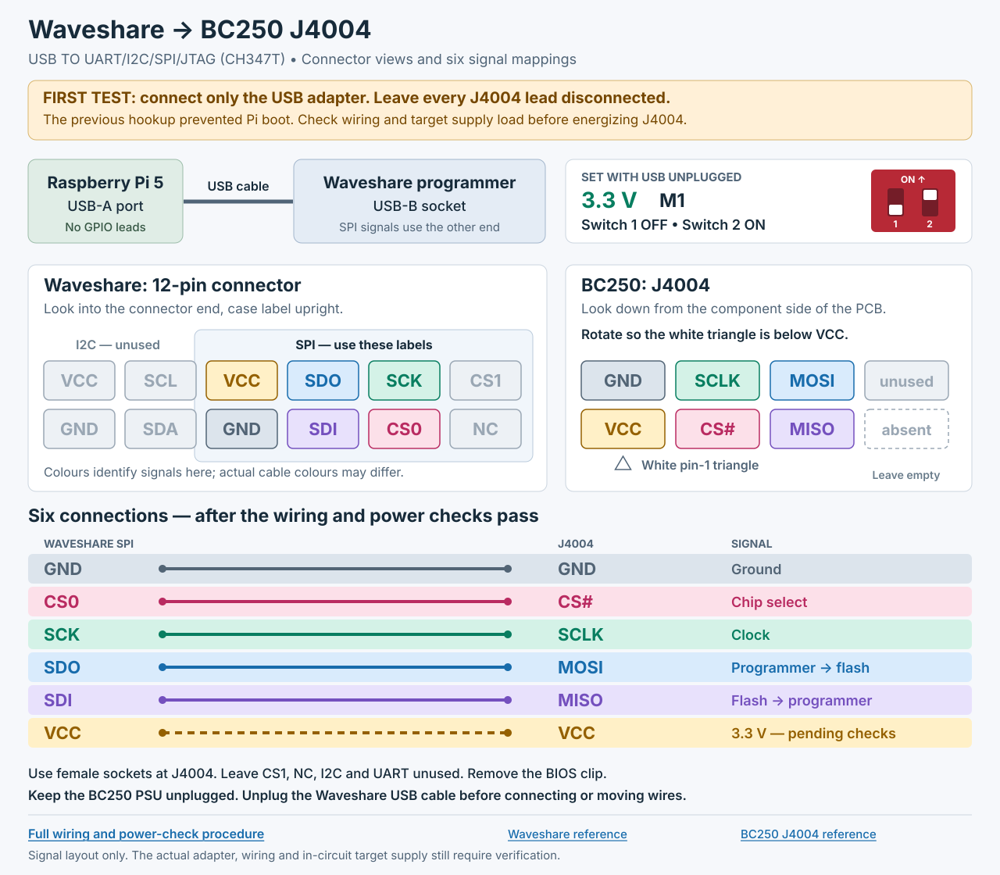

# Waveshare USB programmer → BC250 J4004

**Control BIOS restored and verified, 2026-09-25 14:57:52 UTC.** Flashrom's
full-chip verification passed; a separate 16 MiB readback matches the working
control ROM byte for byte and by SHA256 (`f1251268fc129d6799fcb75041017ee739250d71b7c9d1981d67016923834183`).
The restoration service exited successfully. The user subsequently powered the
BC250 on; SSH confirmed a fresh, healthy boot at 15:01 UTC. All 8 CPU cores/16
threads are present, clocks drop to 800 MHz, and C2/C3 idle residency increases.
The 40-CU restore service completed (configuration restored, not a new compute
validation). The OS and `/boot` remain read-only; there are no failed services.
Video decoding is not yet working: the normal driver still registers no VCN
block. Evidence is in `output/waveshare-recovery-20260925/post-recovery-health.log`.

**Connection verified on 2026-09-25.** The Pi detects the Waveshare in M1;
the user measured 3.3 V across J4004 VCC/GND. Identification at 468.75 kHz
found the expected 16 MiB chip, status 0x40 and no write protection. A complete
external read was copied to the workstation and matches both the written
image and its original readback byte for byte. The second read was cancelled
at the user's request. Those initial connection checks made no BIOS changes;
the subsequent control restoration is recorded above.
The known working recovery ROM is still verified on the Pi at 192.168.0.27.

For the **Waveshare USB TO UART/I2C/SPI/JTAG**, the enclosed CH347T model
with a USB-B socket, two mode switches and a 3.3 V / 5 V selector
([manufacturer reference](https://www.waveshare.com/wiki/USB_TO_UART/I2C/SPI/JTAG)).
Check that the delivered unit matches these controls and labels.

The Pi connects to the Waveshare using **USB-A → USB-B**. Remove all previous
Pi GPIO leads and the BIOS clip. The Waveshare's SPI signals go to J4004.

**Keep J4004 disconnected for the first adapter test.** The Pi previously
failed to boot with J4004 attached. We still need to distinguish a wiring
fault from excessive load on the target's 3.3 V supply. A different programmer
does not establish that this power connection is safe.

## Switches

With the Waveshare's USB cable unplugged:

- Set the voltage selector to **3.3 V**.
- Select **M1**: switch **1 OFF**, switch **2 ON**. Use the printed **ON** mark
  to determine direction. Do not select M2, which is the HID mode.

The settings follow the
[manufacturer's mode diagram](https://www.waveshare.com/w/upload/7/78/USB_TO_UART_I2C_Mode.png).

## Connections



Use the **SPI section of the 12-pin I2C/SPI/JTAG connector**. Viewed straight
into the connector end, with the case's label upright, the manufacturer's
SPI-mode illustration shows:

```text
               I2C             SPI
             ┌─────────┬─────────────────────┐
   top       │ VCC SCL │ VCC  SDO  SCK  CS1  │
   bottom    │ GND SDA │ GND  SDI  CS0  NC   │
             └─────────┴─────────────────────┘
```

Use the signal labels and the
[manufacturer's connector illustration](https://www.waveshare.com/w/upload/e/e1/USB_TO_UART02.png)
to identify cable ends. A view from the back of the cable connector is mirrored.
Do not infer the mapping from wire colours or connect the entire 12-pin plug
to J4004.

| Waveshare **SPI** signal | J4004 signal | Meaning |
| --- | --- | --- |
| **GND** | **GND** | Ground |
| **CS0** | **CS#** | Chip select |
| **SCK** | **SCLK** | Clock |
| **SDO** | **MOSI** | Data from programmer to flash |
| **SDI** | **MISO** | Data from flash to programmer |
| **VCC**, selected to 3.3 V | **VCC** | Target supply — connect only after the power checks below |

Leave CS1, NC, the I2C section and the UART connectors unused.

Look down onto J4004 from the BC250 component side. Rotate your view so the
white pin-1 triangle is below the lower-left VCC position:

```text
                 J4004
       [ GND   SCLK   MOSI   unused ]
       [ VCC   CS#    MISO   absent ]
          ▲ white triangle
```

This signal layout comes from the
[BC250 hardware reference](https://github.com/mothenjoyer69/bc250-documentation/blob/main/hardware.md#j4004).
Bare J4004 numbers are avoided because references use different numbering
conventions. Leave its final column empty.

J4004 needs **female sockets**. Use the supplied 12-pin breakout cable if its
free ends are female and fit J4004; otherwise use suitable female-to-female
jumpers/adapters. Confirm the actual cable's continuity while disconnected.
Your male-to-female leads alone cannot join two male headers.

## First tests

1. Boot the Pi with Ethernet, its normal supply and **no GPIO leads**. Connect
   only the Waveshare USB cable; leave every target wire disconnected.
   `lsusb -d 1a86:55db` should find the CH347T in M1. This checks USB enumeration,
   not the SPI connection.
2. With the adapter alone, measure between its SPI **VCC (+)** and **GND (−)**.
   Expect about **+3.3 V**. Then unplug its USB cable before handling leads.
3. With the BC250 PSU unplugged, the clip removed and all programmer wires
   detached, verify J4004 mapping and check VCC-to-GND resistance. Record the
   resistance, units and whether it settles, plus the reading with the meter's
   probes touching. A continuity beep alone does not establish a short or prove
   the programmer can supply the target.
4. Review those measurements before energizing J4004. In-circuit VCC may power
   other board circuitry; this is a documented
   [flashrom limitation](https://github.com/flashrom/flashrom/blob/main/doc/user_docs/in_system.rst).
   Do not attach signal wires to an unpowered target as a workaround, parallel
   the programmer supply with another supply, or power the BC250 PSU in the
   programmer-powered arrangement. A separate target-power arrangement needs
   its own electrical and bus-isolation check.
5. Once the wiring and power arrangement are established, power down before
   making all six connections. Check voltage at J4004 under load. If either
   device resets, the rail collapses or anything heats unexpectedly, disconnect
   power and investigate before issuing SPI commands.

For continuity checks, J4004 should connect to these **Macronix package legs**:
VCC→8, GND→4, CS#→1, SCLK→6, MOSI→5, MISO→2. Leg numbering follows the chip's
pin-1 marker, not the header layout. See the
[MX25L12872F datasheet](https://www.macronix.com/Lists/Datasheet/Attachments/8935/MX25L12872F,%203V,%20128Mb,%20v1.1.pdf).

## Software and recovery checks

The Waveshare uses flashrom's **`ch347_spi` libusb backend**. A vendor kernel
module is unnecessary for this setup. Use the separate pinned build at
`/opt/bc250-flashrom-1.5.0/bin/flashrom`.
The distro's `/usr/sbin/flashrom` remains available for the historical GPIO
setup. No GPIO bus is involved in USB programming.

The programmer argument is **`ch347_spi:spispeed=468.75K`**. This is the slowest
clock supported by this backend. Upstream 1.4.0 fixes CH347 at 15 MHz; the
unmodified 1.5.0 release supports the reduced clock. The spelling matters:
an unsupported speed can fall back to 15 MHz. Check the initialization log
actually reports **468.75KHz**. See the
[1.5.0 backend](https://github.com/flashrom/flashrom/blob/v1.5.0/ch347_spi.c).

After the electrical checks, start with chip identification and protection
status. The expected JEDEC ID is **C2 20 18** and the reviewed flashrom profile
is **`MX25L12835F/MX25L12873F`** for the presumed MX25L12872F. That shared ID
alone does not establish the exact chip model.

Retain the protection gate from the [full recovery procedure](bios-recovery.md):
the earlier internal status was **0x40**, with BP bits clear and advanced sector
protection disabled. Review any changed status before reading. In flashrom
1.5.0, reads still reach the legacy unlock callback; for this profile it returns
without a status write when `(status & 0x3c) == 0`. A read request must not be
treated as unconditionally free of status-register writes.

For this recovery, the user requested **one complete 16 MiB read compared
against the image we wrote**, instead of a second external read. That check
has passed: the external backup matches both the written file and the saved
original readback. It is retained on the Pi and workstation. Its SHA256 is
`1b43de5733bfeebd79639f855eaff4eba2f19141969a45eb2fc7e91e987b3d2f`.

The known working control BIOS has now been restored with normal full-chip
write verification and an independent full readback comparison. No force,
protection-disabling, OTP or QE-changing option was used. The recorded protection
status stayed at 0x40 with no protected range.

The working control ROM on the Pi is:

```text
/var/lib/bc250-recovery/setup-Rl1O1Tzo/bc250-control-recovery-20260924/RECOVERY-control-coldboot-20260924.rom
SHA256 f1251268fc129d6799fcb75041017ee739250d71b7c9d1981d67016923834183
```

Both reading and control restoration succeeded on this connection. This does
not establish the cause of the earlier Pi-GPIO power problem or identify the
video-key BIOS boot failure. A successful boot remains to be checked.

After verification, unplug the Waveshare USB cable, remove every J4004 lead,
then reconnect the BC250 PSU and power it on. The Pi can remain running.
